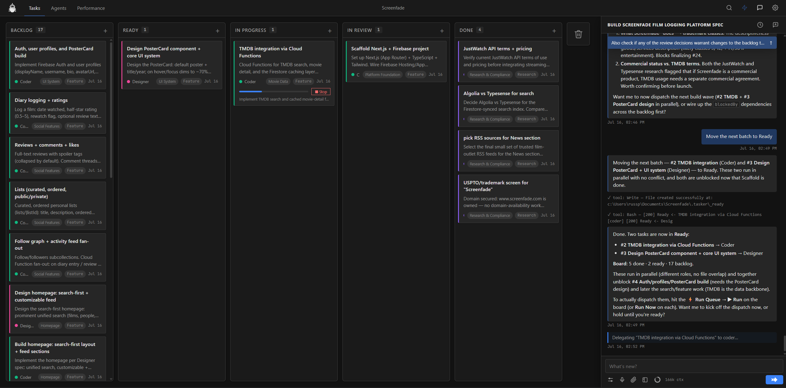

# Tasker

Tasker turns VS Code into a command center for AI coding agents: plan work on a kanban board, dispatch tasks to agents, review the results, and keep the whole run visible inside your editor.

## What Tasker does

- **Kanban task board** — organize work as Backlog, Ready, In Progress, In Review, and Done.
- **Agent dispatch** — send ready tasks to AI coding agents from the board or chat panel.
- **Run Queue** — choose which tasks to run, order them, and dispatch sequentially or in parallel when available.
- **Roles** — use built-in Researcher, Coder, Reviewer, Writer, and Tasker roles, or create your own.
- **Pipelines** — run a task through multiple roles in order, such as Researcher → Coder → Reviewer.
- **Live progress** — see agent activity, current step, status changes, questions, and final output on each card.
- **Review loop** — accept completed work by moving it to Done, or comment and send it back to Ready.
- **Chat panel** — ask about the board, create or update tasks, answer agent questions, and approve sensitive actions.

## Requirements

- VS Code 1.74 or newer.
- At least one supported AI agent driver/model if you want Tasker to dispatch work.

Tasker can still be used as a personal project task board without running agents.

## Install

### From the Marketplace

1. Open the VS Code Extensions view.
2. Search for **Tasker**.
3. Install the extension from **Emberstone Studio**.
4. Reload VS Code if prompted.

### From a VSIX

1. Download the latest release from GitHub.
2. In VS Code, open **Extensions → ... → Install from VSIX...**.
3. Select the `tasker-X.X.X.vsix` file.
4. Reload VS Code if prompted.

## Start Tasker

Open a folder or workspace in VS Code, then use one of these options:

- Click the **Tasker** status bar icon.
- Run **Tasker: Open Board** from the command palette.
- Run **Tasker: Open in Browser** if you prefer the browser view.

On first use in a workspace, Tasker creates a `.tasker/` folder for durable workspace state. Machine-local runtime state is stored separately under the user's Tasker home.

### First-run setup

When no driver is connected, Tasker opens a short setup wizard to connect drivers and review Role assignments. The first connected driver's default model is assigned to every Role once; later connections never overwrite those choices. If setup is skipped, chat and task runs show a setup warning until a driver is connected. Changing Tasker's assigned model requires a server restart.

## Basic workflow

1. Create tasks in **Backlog** or **Ready**.
2. Add clear task descriptions; these become the agent instructions.
3. Choose a role, model, priority, label, epic, or pipeline if needed.
4. Open the **Run Queue** with the ⚡ button, select tasks, and run them.
5. Watch progress on the board while agents work.
6. Review completed tasks in **In Review**.
7. Move accepted work to **Done**, or comment and move it back to **Ready**.

You can also run a single task directly from its detail modal with **Run Now**.

> **Tip:**
> For larger changes, start in the chat panel before creating cards manually. Tell Tasker what you want to accomplish and ask it to break the work into tasks with dependencies and a proposed run plan. Review the plan, adjust anything that looks wrong, then dispatch the queue.

### Free and Pro

Tasker is free to install and use.

- **Free** uses Tasker's selected driver for sequential execution and is limited to one active Tasker workspace/server PID at a time.
- **Pro** unlocks per-role and per-task model routing, automatic fallback, peer chat, parallel runs, multiple simultaneous Tasker workspace instances, and broader orchestration.

## Agents and models

Tasker separates **roles**, **drivers**, and **models**:

- A **role** defines what kind of agent should do the work.
- A **driver** supplies the agent runtime, including Claude Code, Codex, Antigravity, or Local Models through OpenCode.
- A **model** is the model used through that driver.

The **Agents** tab contains the Roles, Drivers, and Models sections. Driver cards handle runtime connections, while the Models catalog provides local and cloud connection options.

### Local Models with OpenCode

The **Local Models · OpenCode** driver connects Tasker to tool-capable models served by Ollama or vLLM. Install [OpenCode](https://opencode.ai/), start a compatible local or remote endpoint, then use **Validate & connect** from its Driver card.

Inference runs on the Ollama or vLLM host; OpenCode and Tasker's filesystem, shell, and tools remain on the Tasker machine. LAN and public endpoints require explicit trust, and a local endpoint does not by itself make the system air-gapped.

## Run Queue

The Run Queue is the safest way to dispatch work:

- Select exactly which Ready tasks should run.
- Reorder tasks for sequential runs.
- Choose sequential or parallel execution when supported.
- Stop an active run plan if you need to pause work.
- Resume after usage caps, rate limits, or configuration issues are resolved.

Tasker dispatch is explicit, queue-based, and visible.

### Pipelines

Pipelines let one task move through multiple roles automatically. For example:

1. Researcher gathers context.
2. Coder implements the change.
3. Reviewer checks the result.

Each step receives the prior step's output, and the task moves to **In Review** after the final step.

## Chat panel

The chat panel is both a workspace assistant and Tasker's team lead. Use it to:

- Ask what is happening on the board.
- Create, update, or summarize tasks.
- Answer agent clarification questions.
- Review dispatch results and completion summaries.
- Approve or deny sensitive actions such as commits, PRs, or release steps when requested.

Chats are stored by Tasker with the workspace so workspace context can persist across sessions.

### Voice and audio

Tasker includes optional on-device voice features:

- **Voice dictation** with local Whisper-based transcription.
- **Text-to-speech** with local Piper voices.
- Optional hardware acceleration when supported.

Voice input and output are processed locally. Voice models and binaries may be downloaded on demand.

## Privacy and permissions

Tasker is designed around explicit workspace-local state and configurable execution permissions.

- Board data is stored under `.tasker/` in your workspace.
- Global Tasker settings and credentials are stored outside the workspace.
- Agent permissions can be configured for file reads, edits, shell commands, web access, MCP tools, delegation, and integrations.
- Voice processing runs locally unless you choose external models or services for other work.

> **Important:**
> Because Tasker dispatches real coding agents, review your driver/model configuration and permission settings before running agents on sensitive repositories.

## Commands

Tasker contributes these VS Code commands:

| Command | Purpose |
|---|---|
| **Tasker: Open Board** | Open the Tasker board in VS Code |
| **Tasker: Open in Browser** | Open the board in your browser |
| **Tasker: Start Server** | Start the Tasker server in the current workspace |
| **Tasker: Stop Server** | Stop the Tasker server in the current workspace |

Some supported CLI drivers may also expose Tasker shortcuts such as `/tasker`, `/tasker-queue`, and `/tasker-run`.

## Data locations

| Location | Purpose |
|---|---|
| `.tasker/chats/` | Tasker chat sessions for the workspace |
| `.tasker/roles/` | Workspace role definitions and memory |
| `.tasker/tasks/` | Workspace task state, attachments, and active task files |
| `~/.tasker/models/` | User-global connected and probed model dossiers |
| `~/.tasker/workspaces/<workspace-hash>/runtime/` | Workspace-scoped runtime state such as agent PIDs and session maps |
| `~/.tasker/workspaces/<workspace-hash>/role-runs/` | Workspace-scoped agent transcripts and run artifacts |
| `~/.tasker/settings.json` | Global Tasker settings, including permission policy |
| `~/.tasker/whisper/` | Downloaded local voice transcription assets |
| `~/.tasker/piper/` | Downloaded local text-to-speech assets |

The workspace `.tasker/` folder is plaintext so it can be inspected, backed up, or committed intentionally with your repository. **Commit Tasker to Git** is enabled by default and allows this durable workspace state to be tracked; it does not create Git commits automatically. Machine-local runtime and run-transcript paths are always ignored. Turning the setting off ignores the entire workspace `.tasker/` folder. Runtime directories from older releases are verified, migrated into the workspace-scoped user location, and removed during initialization.

---

See [`vscode-extension/CHANGELOG.md`](vscode-extension/CHANGELOG.md) for release history.

*Patent Pending — US Application 64/076,775 · © 2026 [Emberstone Studio](https://emberstone-studio.com/)*
